Markdown

# Homelab: Sustainable IT Engineering Playground

## 📖 Project Overview
This project is an implementation of an **ultra-efficient, laptop-based home server**. The goal was to build a fully self-hosted private cloud capable of running enterprise-grade services (Immich, Nextcloud, n8n) with minimal power consumption.

Key features include creative software solutions to overcome hardware limitations (e.g., using the battery as a UPS, AI workload scheduling).

## 🏗️ Architecture
The system is built on **Proxmox VE**, utilizing a containerized (LXC + Docker) environment.

```mermaid
%%{init: {'theme': 'base', 'themeVariables': { 'mainBkg': '#ffffff', 'clusterBkg': '#ffffff', 'primaryColor': '#007ACC', 'edgeLabelBackground':'#ffffff', 'tertiaryColor': '#F9F9F9', 'fontFamily': 'arial'}}}%%
graph TD
    %% --- STÍLUS DEFINÍCIÓK ---
    classDef user fill:#FFD700,stroke:#333,stroke-width:2px,color:black;
    classDef netService fill:#FF9900,stroke:#333,stroke-width:2px,color:white,stroke-dasharray: 5 5;
    classDef physical fill:#F4F4F4,stroke:#666,stroke-width:2px,stroke-dasharray: 2 2;
    classDef hypervisor fill:#E6F2FF,stroke:#007ACC,stroke-width:2px;
    classDef container fill:#E8F5E9,stroke:#28a745,stroke-width:2px;
    classDef app fill:#FFFFFF,stroke:#007ACC,stroke-width:1px,rx:5,ry:5;
    classDef storage fill:#FFE5CC,stroke:#D9534F,stroke-width:3px,shape:cylinder;
    classDef hardware fill:#E1D5E7,stroke:#9673A6,stroke-width:2px;

    %% --- 1. SZINT: FELHASZNÁLÓK ---
    User((Admin / User)):::user
    
    subgraph Network_Layer [🌐 Network Access Layer]
        direction TB
        CF{{Cloudflare Tunnel}}:::netService
        Meshnet{{NordVPN Meshnet}}:::netService
    end

    %% --- 2. SZINT: FIZIKAI GÉP ---
    subgraph Dynabook_Host [💻 Physical Host: Dynabook Laptop]
        class Dynabook_Host physical

        %% --- 3. SZINT: VIRTUALIZÁCIÓ ---
        subgraph PVE_Host [☁️ Proxmox VE 8]
            class PVE_Host hypervisor
            PVE_Shell[Proxmox Shell]:::app

            %% BAL OLDAL: MONITORING
            subgraph LXC102 [LXC 102: Monitor]
                class LXC102 container
                Kuma[Uptime Kuma]:::app
                Glances[Glances]:::app
                Scrutiny[Scrutiny]:::app
            end

            %% JOBB OLDAL: DOCKER APPOK
            subgraph LXC101 [LXC 101: Docker Host]
                class LXC101 container
                
                subgraph Apps_General [Produktivitás]
                    Portainer:::app
                    Nextcloud:::app
                    n8n:::app
                end

                subgraph Apps_AI [Media & AI]
                    Immich_Srv[Immich Server]:::app
                    Immich_ML[Immich ML]:::app
                    WebUI[Open WebUI]:::app
                    Ollama:::app
                end
            end
        end

        %% --- 4. SZINT: HARDVER (Legalul) ---
        subgraph Hardware_Layer [⚙️ Hardware & Storage]
            direction LR
            iGPU[Intel UHD 620 iGPU]:::hardware
            NVMe[(System NVMe)]:::storage
            ExtSSD[(1TB External SSD)]:::storage
        end
    end

    %% ==========================================================
    %% KAPCSOLATOK (A sorrend fontos a színezéshez!)
    %% ==========================================================

    %% 1. CSOPORT: FELHASZNÁLÓI BELÉPÉS (Fekete/Szürke)
    User == "HTTPS" ==> CF
    User -- "VPN" --> Meshnet

    %% 2. CSOPORT: HÁLÓZATI FORGALOM (KÉK - Blue) 🔵
    CF --> Nextcloud
    CF --> Immich_Srv
    CF --> n8n
    CF --> WebUI
    Meshnet -.-> PVE_Shell

    %% 3. CSOPORT: ADATTÁROLÁS (PIROS - Red) 🔴
    %% Vastag nyilak jelzik az adatmozgást
    ExtSSD ===> Nextcloud
    ExtSSD ===> Immich_Srv
    NVMe ===> PVE_Shell

    %% 4. CSOPORT: HARDVER GYORSÍTÁS (LILA - Purple) 🟣
    iGPU ==> Immich_ML
    iGPU ==> Ollama

    %% 5. CSOPORT: MONITORING (SZÜRKE/DOTTED - Grey) ⚫
    Glances -.-> PVE_Shell
    Scrutiny -.-> ExtSSD
    Scrutiny -.-> NVMe
    Kuma -.-> Apps_General
    
    %% 6. CSOPORT: BELSŐ KOMMUNIKÁCIÓ (ZÖLD - Green) 🟢
    WebUI --> Ollama
    Immich_Srv --> Immich_ML

    %% ==========================================================
    %% SZÍNEZÉS (LinkStyle - Index alapú!)
    %% ==========================================================
    
    %% User Connections (0,1) - Default Black
    
    %% Network Ingress (2,3,4,5,6) -> BLUE
    linkStyle 2,3,4,5,6 stroke:#007ACC,stroke-width:2px;

    %% Storage Bind Mounts (7,8,9) -> RED / ORANGE
    linkStyle 7,8,9 stroke:#D9534F,stroke-width:4px;

    %% Hardware Passthrough (10,11) -> PURPLE
```

## ⚙️ Hardware Specifications

The server runs on a repurposed business ultrabook acting as a host with a built-in UPS (battery).
|‎ **Component**‎‎‎ - **Specification**
|‎ **Device** - Dynabook Portégé X30-F
|‎ **CPU** - Intel Core i5-8265U (4C/8T)
|‎ **RAM** - 16 GB DDR4
|‎ **Internal Storage**‎ - 256 GB NVMe
|‎ **External Storage** - 1 TB Samsung 860 EVO (USB)

## 🛠️ Tech Stack & Solutions

### 1. Containerization & DevOps

-   **Hypervisor:** Proxmox VE (Bare Metal).
    
-   **Orchestration:** Docker Compose + Portainer (Running inside LXC with Nesting).
    
-   **Services:**
    
    -   **Data:** Immich (Photos/Video), Nextcloud (Files).
        
    -   **Automation:** n8n, Custom Bash Scripts.
        
    -   **AI:** Ollama (Local LLM), Immich Machine Learning.
        

### 2. Networking & Security

-   **Zero Trust:** Cloudflare Tunnel used instead of open ports for public services.
    
-   **VPN:** NordVPN Meshnet (Gateway mode) for secure admin access and SSH.
    
-   **Monitoring:** Glances (Resources), Uptime Kuma (Service Health), Scrutiny (HDD Health).
    

##  Key Engineering Challenges

### - Battery Management (Laptop as UPS)

Running a laptop 24/7 on AC power can damage the battery.

-   **Solution:** BIOS "Eco Charge" limit (80%) + Custom **Bash Script** monitoring `/sys/class/power_supply`.
    
-   **Logic:** If power is lost AND battery drops < 15% -> `shutdown -h now` (Graceful Shutdown).
    

### - Storage Mounting in LXC

Proxmox LXC containers do not see USB drives on the Host by default.

-   **Issue:** Docker services threw `EACCES` and `ENOENT` errors.
    
-   **Solution:**
    
    1.  Host level `fstab` mount by UUID.
        
    2.  LXC Bind Mount configuration (`mp0: /mnt/ssd,mp=/mnt/external_drive`).
        
    3.  User mapping fix (`chown 1000:1000`) for Docker compatibility.
        

### - Resource Optimization (AI Scheduling)

16GB RAM is limited for running heavy AI models alongside other services.

-   **Solution:** Scheduled Resource Management.
    
-   **Implementation:** Cron jobs stop the `immich_machine_learning` container during the day and start it only at night (22:00-08:00).